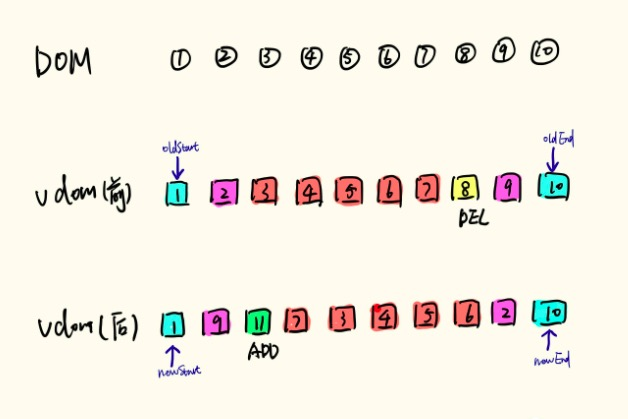
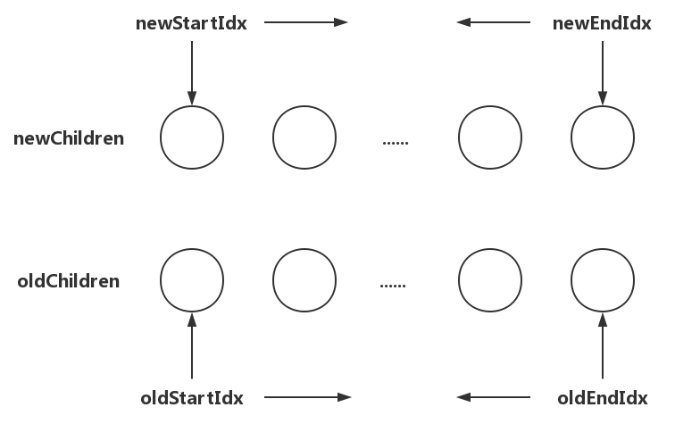
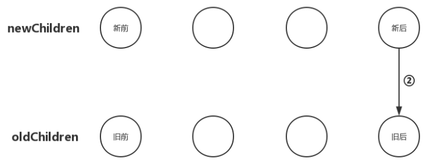

vue diff算法新旧VNode比对不能像平常一样循环比对，要不然的话，当子节点过多的时候，算法的复杂度会很高，性能开销太大。

首先，我们弄懂几个概念：
newStart,(新前)，新VDOM的第一个
newEnd(新后)，新VDOM的最后一个
oldStart(旧前)，旧VDOM的第一个
oldEnd(旧后)，旧VDOM最后一个
来看一张图，很明了


<!-- more -->

> while循环不是简单的从一个方向，从前往后，或从后往前循环，而是要从两边往中间走



* newStartIdx:newChildren数组里开始位置的下标；
* newEndIdx:newChildren数组里结束位置的下标；
* oldStartIdx:oldChildren数组里开始位置的下标；
* oldEndIdx:oldChildren数组里结束位置的下标；

**newStartIdx**和**oldStartIdx**只能往后移动（只会加），**newEndIdx**和**oldEndIdx**只能往前移动（只会减）。

当开始位置大于结束位置时，表示所有节点都已经遍历过了。


```
// 源码位置： /src/core/vdom/patch.js

// 循环更新子节点
function updateChildren (parentElm, oldCh, newCh, insertedVnodeQueue, removeOnly) {
  // 为oldCh和newCh分别建立索引，为之后遍历的依据
  let oldStartIdx = 0               // oldChildren开始索引
  let oldEndIdx = oldCh.length - 1   // oldChildren结束索引
  let oldStartVnode = oldCh[0]        // oldChildren中所有未处理节点中的第一个
  let oldEndVnode = oldCh[oldEndIdx]   // oldChildren中所有未处理节点中的最后一个

  let newStartIdx = 0               // newChildren开始索引
  let newEndIdx = newCh.length - 1   // newChildren结束索引
  let newStartVnode = newCh[0]        // newChildren中所有未处理节点中的第一个
  let newEndVnode = newCh[newEndIdx]  // newChildren中所有未处理节点中的最后一个

  let oldKeyToIdx, idxInOld, vnodeToMove, refElm

  // removeOnly is a special flag used only by <transition-group>
  // to ensure removed elements stay in correct relative positions
  // during leaving transitions
  const canMove = !removeOnly

  if (process.env.NODE_ENV !== 'production') {
    checkDuplicateKeys(newCh)
  }

  // 以"新前"、"新后"、"旧前"、"旧后"的方式开始比对节点
  while (oldStartIdx <= oldEndIdx && newStartIdx <= newEndIdx) {
    // 如果oldStartVnode不存在，则直接跳过，比对下一个
    if (isUndef(oldStartVnode)) {
      oldStartVnode = oldCh[++oldStartIdx] 

    //如果oldEndVnode不存在，则直接跳过，将oldEndIdx减1，比对前一个
    } else if (isUndef(oldEndVnode)) {
      oldEndVnode = oldCh[--oldEndIdx]

    // 如果新前与旧前节点相同，就把两个节点进行patch更新
    } else if (sameVnode(oldStartVnode, newStartVnode)) {
      patchVnode(oldStartVnode, newStartVnode, insertedVnodeQueue)
      oldStartVnode = oldCh[++oldStartIdx]
      newStartVnode = newCh[++newStartIdx]

    // 如果新后与旧后节点相同，就把两个节点进行patch更新
    } else if (sameVnode(oldEndVnode, newEndVnode)) {
      patchVnode(oldEndVnode, newEndVnode, insertedVnodeQueue)
      oldEndVnode = oldCh[--oldEndIdx]
      newEndVnode = newCh[--newEndIdx]
      
    // 如果新后与旧前节点相同，先把两个节点进行patch更新，然后把旧前节点移动到oldChilren中所有未处理节点之后
    } else if (sameVnode(oldStartVnode, newEndVnode)) { // Vnode moved right
      patchVnode(oldStartVnode, newEndVnode, insertedVnodeQueue)
      canMove && nodeOps.insertBefore(parentElm, oldStartVnode.elm, nodeOps.nextSibling(oldEndVnode.elm))
      oldStartVnode = oldCh[++oldStartIdx]
      newEndVnode = newCh[--newEndIdx]

    // 如果新前与旧后节点相同，先把两个节点进行patch更新，然后把旧后节点移动到oldChilren中所有未处理节点之前
    } else if (sameVnode(oldEndVnode, newStartVnode)) { // Vnode moved left
      patchVnode(oldEndVnode, newStartVnode, insertedVnodeQueue)
      canMove && nodeOps.insertBefore(parentElm, oldEndVnode.elm, oldStartVnode.elm)
      oldEndVnode = oldCh[--oldEndIdx]
      newStartVnode = newCh[++newStartIdx]

    // 如果不属于以上四种情况，就进行常规的循环比对patch
    } else {
      if (isUndef(oldKeyToIdx)) oldKeyToIdx = createKeyToOldIdx(oldCh, oldStartIdx, oldEndIdx)
      idxInOld = isDef(newStartVnode.key)
        ? oldKeyToIdx[newStartVnode.key]
        : findIdxInOld(newStartVnode, oldCh, oldStartIdx, oldEndIdx)

      // 如果在oldChildren里找不到当前循环的newChildren里的子节点
      if (isUndef(idxInOld)) { // New element
        // 新增节点并插入到合适位置
        createElm(newStartVnode, insertedVnodeQueue, parentElm, oldStartVnode.elm, false, newCh, newStartIdx)

        // 如果在oldChildren里找到了当前循环的newChildren里的子节点
      } else {
        vnodeToMove = oldCh[idxInOld]

        // 如果两个节点相同
        if (sameVnode(vnodeToMove, newStartVnode)) {

          // 调用patchVnode更新节点
          patchVnode(vnodeToMove, newStartVnode, insertedVnodeQueue)
          oldCh[idxInOld] = undefined

          // canmove表示是否需要移动节点，如果为true表示需要移动，则移动节点，如果为false则不用移动
          canMove && nodeOps.insertBefore(parentElm, vnodeToMove.elm, oldStartVnode.elm)
        } else {
          // same key but different element. treat as new element
          createElm(newStartVnode, insertedVnodeQueue, parentElm, oldStartVnode.elm, false, newCh, newStartIdx)
        }
      }
      newStartVnode = newCh[++newStartIdx]
    }
  }
  if (oldStartIdx > oldEndIdx) {
    /**
      * 如果oldChildren比newChildren先循环完毕，
      * 那么newChildren里面剩余的节点都是需要新增的节点，
      * 把[newStartIdx, newEndIdx]之间的所有节点都插入到DOM中
      */
    refElm = isUndef(newCh[newEndIdx + 1]) ? null : newCh[newEndIdx + 1].elm
    addVnodes(parentElm, refElm, newCh, newStartIdx, newEndIdx, insertedVnodeQueue)
  } else if (newStartIdx > newEndIdx) {
    /**
      * 如果newChildren比oldChildren先循环完毕，
      * 那么oldChildren里面剩余的节点都是需要删除的节点，
      * 把[oldStartIdx, oldEndIdx]之间的所有节点都删除
      */
    removeVnodes(parentElm, oldCh, oldStartIdx, oldEndIdx)
  }
}
```

**1. 新前和旧前**
把newChildren数组里的所有未处理子节点的第一个子节点和oldChildren数组里所有未处理子节点的第一个子节点做比对，如果相同，直接进入更新节点的操作并且由于新前与旧前两个节点的位置也相同，无需进行节点移动操作


**2. 新后和旧后**
把newChildren数组里所有未处理子节点的最后一个子节点和oldChildren数组里所有未处理子节点的最后一个子节点做比对，如果相同，那就直接进入更新节点的操作并且由于新后与旧后两个节点的位置也相同，无需进行节点移动操作


**3. 新后和旧前**
把newChildren数组里所有未处理子节点的最后一个子节点和oldChildren数组里所有未处理子节点的第一个子节点做比对，如果相同，那就直接进入更新节点的操作，更新完后再将oldChildren数组里的该节点移动到与newChildren数组里节点相同的位置；


注意，我们要把oldChildren数组里把第一个子节点移动到数组中**所有未处理节点之后。**

**4. 新前和旧后**
把newChildren数组里所有未处理子节点的第一个子节点和oldChildren数组里所有未处理子节点的最后一个子节点做比对，如果相同，那就直接进入更新节点的操作，更新完后再将oldChildren数组里的该节点移动到与newChildren数组里节点相同的位置；

注意，我们要把oldChildren数组里把最后一个子节点移动到数组中**所有未处理节点之前。**


Vue为了避免双重循环数据量大时间复杂度升高带来的性能问题，而选择了从子节点数组中的4个特殊位置互相比对。以上就是Vue中的patch过程，即DOM-Diff算法所有内容了，到这里相信你再读这部分源码的时候就有比较清晰的思路了。


---

参考文档：
https://github.com/vuejs/vue/tree/dev/src/core
https://cn.vuejs.org/v2/guide/reactivity.html
https://vue-js.com/learn-vue/start/
https://blog.csdn.net/M6i37JK/article/details/78140159
https://blog.csdn.net/u010692018/article/details/78799335


